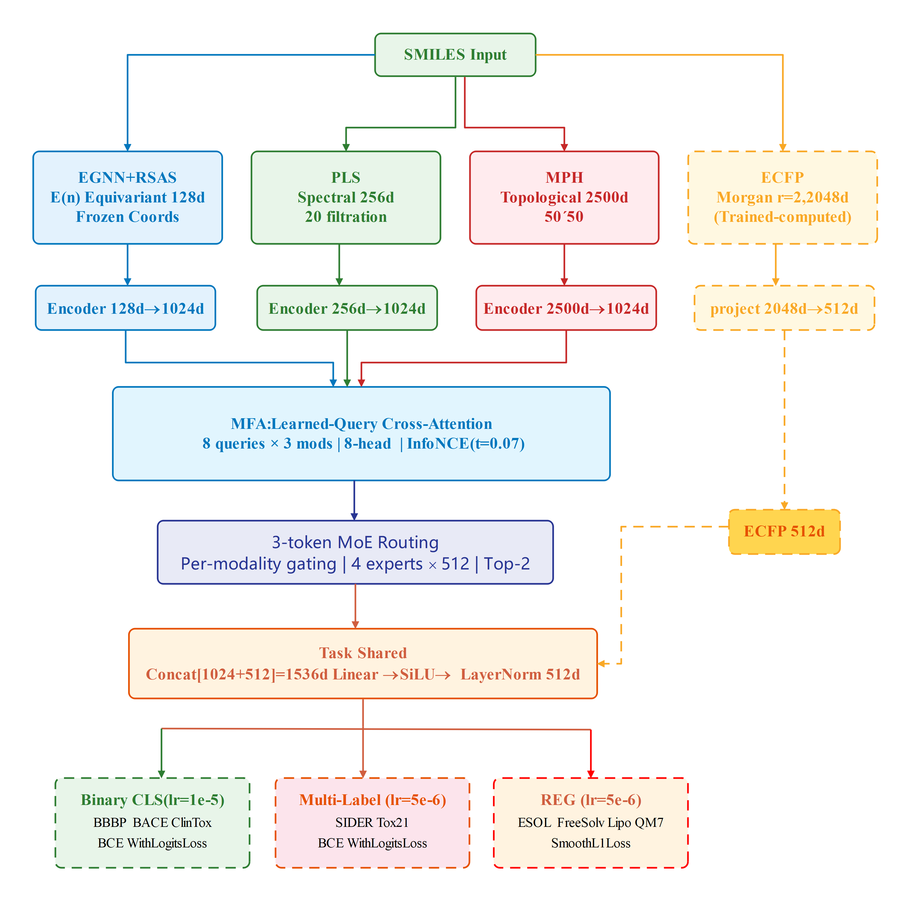

# Multi-Modal Molecular Property Prediction via Physical Chemistry Features and 3-Token Mixture-of-Experts Routing
PhyChem-MoE  extracts four complementary views—equivariant geometry, persistent Laplacian spectra, persistent homology, and extended connectivity fingerprints—and routes the three physical modalities as independent tokens through a mixture-of-experts gate. We employ this methods to enable the model to learn information fusion and achieve improved performance in downstream tasks. The core idea that mixture-of-experts gates require diversity of inputs, and splitting one entity into physically separate channels provides this, may generalize to any case where samples are provided with multiple representations.

 Fig.1 **PhyChem-MoE architecture**. Four parallel feature pipelines (EGNN, PLS, MPH, ECFP) extract complementary molecular representations. Three physical modalities are aligned via MFA ( learned-query cross-attention and routed through per-modality MoE). ECFP 
bypasses the physical pathway and concatenates at the Task Shared layer. Three independent model groups handle binary classification, multi-label classification, and regression. 

## Dataset
We evaluate on all nine MoleculeNet benchmarks:

| Dataset | Task Type | #Samples | #Outputs | Metric |
|:--------|:----------|:--------:|:--------:|:-------|
| BBBP | Binary CLS | 2,039 | 1 | ROC-AUC |
| BACE | Binary CLS | 1,513 | 1 | ROC-AUC |
| ClinTox | Binary CLS | 1,478 | 2 | ROC-AUC |
| SIDER | Multi-Label CLS | 1,427 | 27 | ROC-AUC |
| Tox21 | Multi-Label CLS | 7,831 | 12 | ROC-AUC |
| FreeSolv | Regression | 642 | — | RMSE |
| ESOL | Regression | 1,128 | — | RMSE |
| Lipophilicity | Regression | 4,200 | — | RMSE |
| QM7 | Regression | 6,830 | — | MAE |

## Installation Environment
pip install -r requirements.txt

## Train the Model 
python scripts/train.py --config configs/default.yaml

## Model Evaluation 
python scripts/evaluate.py --config configs/default.yaml --checkpoint outputs/best.pt
